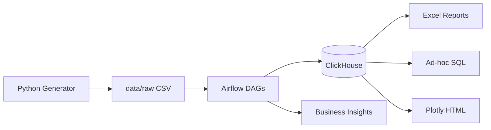

# Jet Fleet Intelligence

End-to-end analytics platform for micromobility operations: Airflow automation, ClickHouse storage, ad-hoc SQL, Excel reports for ops teams, and documented business insights.

[CI](https://github.com/nursultanm4/Jet_DataAnalyst/actions/workflows/ci.yml)

---

***Data is synthetic and does not contain real JET information.*

## About

JET Group is a leading micromobility operator across Kazakhstan, Central Asia, the Caucasus, and Latin America. This repository demonstrates typical workflows and tasks of a JET Data Analyst:


| Task | Implementation |
| -------------------------------- | ------------------------------------------------- |
| Airflow Automation (Python) | 3 DAGs: ETL, reporting, anomaly detection |
| Excel | Weekly Market Performance + Ops Rebalancing Sheet |
| Ad-hoc Queries | 15 SQL templates + CLI |
| ClickHouse + SQL | Star schema, materialized views, OLAP |
| Visualization & Insights | Plotly HTML, Excel charts, `docs/insights/` |


### Key Features

- **6 markets** (KZ, UZ, AZ, GE, MN, BR) with 90 days of synthetic data
- **Rebalancing Score** — scooter repositioning prioritization metric
- **Built-in anomalies** — fleet idle spike in Tashkent, revenue drop in São Paulo, maintenance spike in Almaty

---

## Architecture




Learn more: [docs/architecture.md](docs/architecture.md)

---

## Quick Start

### Requirements

- Docker & Docker Compose
- Python 3.11+ (for local scripts)

### Getting Started

```bash
# 1. Clone and configure
cp .env.example .env

# 2. Start infrastructure
make up

# 3. Generate data and initialize ClickHouse
make seed

# 4. Ingest data (locally or via Airflow UI)
make run-etl
```

- **Airflow UI:** [http://localhost:8080](http://localhost:8080) (admin / admin)
- **ClickHouse:** [http://localhost:8123](http://localhost:8123)

### Airflow DAGs


| DAG | Schedule | Description |
| ---------------------- | --------------- | ---------------------------------- |
| `daily_fleet_etl` | 06:00 UTC daily | CSV → staging → marts → aggregates |
| `anomaly_detection` | 07:00 UTC daily | z-score anomalies → anomaly_log |
| `weekly_market_report` | Mon 08:00 UTC | Excel + Plotly by market |


---

## Ad-hoc Queries

```bash
# DAU by market
python scripts/run_query.py -q q01 -p date_from=2025-01-01 date_to=2025-01-31

# Rebalancing Score for UZ
python scripts/run_query.py -q q10 -p market_code=UZ limit=20

# Unit economics
python scripts/run_query.py -q q03
```

All queries: [sql/adhoc/](sql/adhoc/)

---

## Excel Reports

```bash
make report
```

Generates:

- `reports/weekly/weekly_market_*.xlsx` — market summary, UZ zone heatmap
- `reports/weekly/rebalancing_{UZ,BR,KZ}_*.xlsx` — ops sheets with Rebalancing Score
- `reports/weekly/weekly_chart_*.html` — interactive visualizations

---

## Business Insights


| Report | Topic |
| ------------------------------------------------------------------------------------ | ------------------------------ |
| [01_tashkent_idle_fleet.md](docs/insights/01_tashkent_idle_fleet.md) | +40% idle fleet in UZ suburbs |
| [02_sao_paulo_revenue_drop.md](docs/insights/02_sao_paulo_revenue_drop.md) | −25% revenue drop in BR |
| [03_rebalancing_recommendations.md](docs/insights/03_rebalancing_recommendations.md) | Ops playbook + ROI |


---

## Business Metrics


| Metric | Description |
| ------------------- | ------------------------ |
| Utilization rate | rides / active_scooters |
| Revenue/scooter/day | unit economics |
| Idle rate | share of available snapshots |
| Rebalancing Score | repositioning priority |


Data dictionary: [docs/data_dictionary.md](docs/data_dictionary.md)

---

## Repository Structure

```
Jet_DataAnalyst/
├── dags/              # Airflow DAGs
├── sql/               # DDL, analytics, ad-hoc (15+ queries)
├── src/               # ETL, generator, Excel, ClickHouse client
├── scripts/           # CLI utilities
├── docs/              # Architecture, insights, data dictionary
├── tests/             # pytest
└── docker-compose.yml
```

---

## Testing

```bash
pip install -r requirements.txt
make test
make lint
```

---
