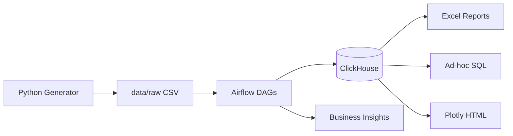

# Jet Fleet Intelligence

End-to-end аналитическая платформа для операций микромобильности: автоматизация в Airflow, хранение в ClickHouse, ad-hoc SQL, Excel-отчёты для ops-команд и документированные бизнес-инсайты.

[CI](https://github.com/nursultanm4/Jet_DataAnalyst/actions/workflows/ci.yml)

---

***Данные синтетические, не содержат реальной информации JET.*

## About

JET Group - лидер микромобильности в Казахстане, Центральной Азии, на Кавказе и в Латинской Америке. Этот репозиторий демонстрирует типичные задачи аналитика JET:


| Задача                           | Реализация                                        |
| -------------------------------- | ------------------------------------------------- |
| Автоматизация в Airflow (Python) | 3 DAG: ETL, отчёты, аномалии                      |
| Excel                            | Weekly Market Performance + Ops Rebalancing Sheet |
| Ad-hoc запросы                   | 15 SQL-шаблонов + CLI                             |
| ClickHouse + SQL                 | Star schema, materialized views, OLAP             |
| Визуализация и инсайты           | Plotly HTML, Excel charts, `docs/insights/`       |


### Уникальные фичи

- **6 рынков** (KZ, UZ, AZ, GE, MN, BR) с синтетическими данными за 90 дней
- **Rebalancing Score** — метрика приоритизации перераспределения самокатов
- **Встроенные аномалии** — простой парка в Ташкенте, падение выручки в São Paulo, maintenance spike в Almaty

---

## Архитектура




Подробнее: [docs/architecture.md](docs/architecture.md)

---

## Quick Start

### Требования

- Docker & Docker Compose
- Python 3.11+ (для локальных скриптов)

### Запуск

```bash
# 1. Клонировать и настроить
cp .env.example .env

# 2. Поднять инфраструктуру
make up

# 3. Сгенерировать данные и инициализировать ClickHouse
make seed

# 4. Загрузить данные (локально или через Airflow UI)
make run-etl
```

- **Airflow UI:** [http://localhost:8080](http://localhost:8080) (admin / admin)
- **ClickHouse:** [http://localhost:8123](http://localhost:8123)

### Airflow DAGs


| DAG                    | Расписание      | Описание                           |
| ---------------------- | --------------- | ---------------------------------- |
| `daily_fleet_etl`      | 06:00 UTC daily | CSV → staging → marts → aggregates |
| `anomaly_detection`    | 07:00 UTC daily | z-score аномалии → anomaly_log     |
| `weekly_market_report` | Mon 08:00 UTC   | Excel + Plotly по рынкам           |


---

## Ad-hoc запросы

```bash
# DAU по рынкам
python scripts/run_query.py -q q01 -p date_from=2025-01-01 date_to=2025-01-31

# Rebalancing Score для UZ
python scripts/run_query.py -q q10 -p market_code=UZ limit=20

# Unit economics
python scripts/run_query.py -q q03
```

Все запросы: [sql/adhoc/](sql/adhoc/)

---

## Excel-отчёты

```bash
make report
```

Генерирует:

- `reports/weekly/weekly_market_*.xlsx` — сводка по рынкам, heatmap зон UZ
- `reports/weekly/rebalancing_{UZ,BR,KZ}_*.xlsx` — ops-листы с Rebalancing Score
- `reports/weekly/weekly_chart_*.html` — интерактивная визуализация

---

## Бизнес-инсайты


| Отчёт                                                                                | Тема                           |
| ------------------------------------------------------------------------------------ | ------------------------------ |
| [01_tashkent_idle_fleet.md](docs/insights/01_tashkent_idle_fleet.md)                 | Простой парка +40% в suburb UZ |
| [02_sao_paulo_revenue_drop.md](docs/insights/02_sao_paulo_revenue_drop.md)           | Падение выручки −25% BR        |
| [03_rebalancing_recommendations.md](docs/insights/03_rebalancing_recommendations.md) | Ops playbook + ROI             |


---

## Бизнес-метрики


| Метрика             | Описание                 |
| ------------------- | ------------------------ |
| Utilization rate    | rides / active_scooters  |
| Revenue/scooter/day | unit economics           |
| Idle rate           | доля available snapshots |
| Rebalancing Score   | приоритет repositioning  |


Словарь данных: [docs/data_dictionary.md](docs/data_dictionary.md)

---

## Структура репозитория

```
Jet_DataAnalyst/
├── dags/              # Airflow DAGs
├── sql/               # DDL, analytics, ad-hoc (15+ queries)
├── src/               # ETL, generator, Excel, ClickHouse client
├── scripts/           # CLI utilities
├── docs/              # Architecture, insights, data dictionary
├── tests/             # pytest
└── docker-compose.yml
```

---

## Тестирование

```bash
pip install -r requirements.txt
make test
make lint
```

---

